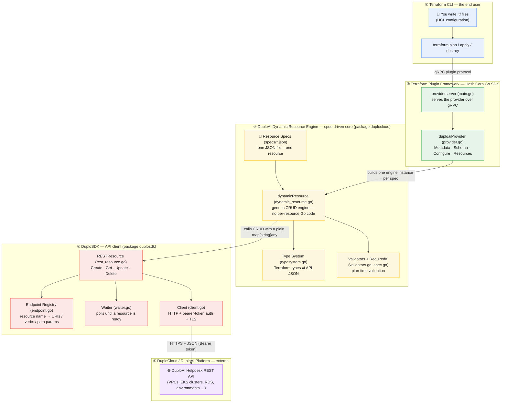
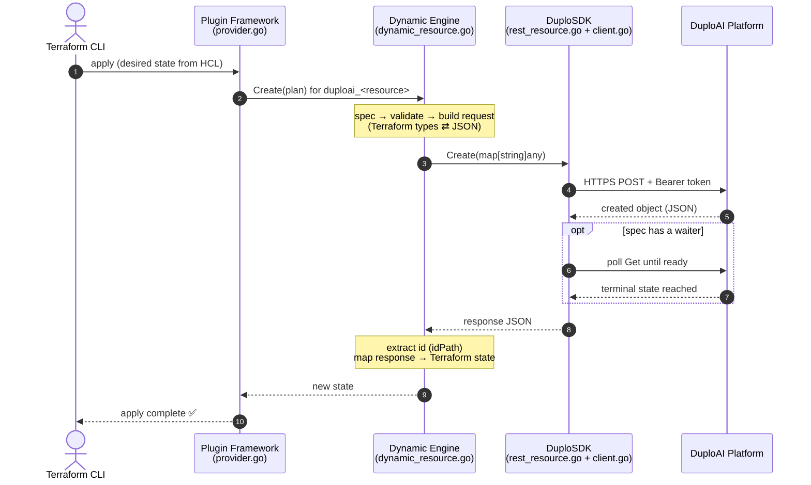

# terraform-provider-duploai — Architecture

This document explains how the provider is built, end to end. It is written for
**newcomers who want to contribute**: read it once and you'll know where each
piece of behaviour lives and how a single `terraform apply` flows through the
layers.

The core idea to internalise first:

> **Adding a new resource requires no new Go code — only a new JSON spec file.**
> A single generic engine turns each spec into a fully functional Terraform
> resource at runtime. This is the "boto3 model" applied to a Terraform provider.

---

## The Big Picture

---

## The Layers, Top to Bottom

### ① Terraform CLI — *the end user*
What the user touches. You declare resources in HCL (e.g.
`resource "duploai_network_baseline" "vpc" { ... }`) and run `terraform plan`,
`apply`, or `destroy`. The CLI launches our provider as a plugin and talks to it
over a gRPC protocol — you never call our Go code directly.

### ② Terraform Plugin Framework — *HashiCorp's Go SDK*
The official SDK that handles all the gRPC plumbing, state management, and plan
diffing so we don't have to.

- [`main.go`](main.go) — the entry point. Calls `providerserver.Serve(...)` to
  expose the provider to Terraform.
- [`duplocloud/provider.go`](duplocloud/provider.go) — implements the framework's
  `Provider` interface:
  - **Schema** — declares provider config: `duplo_host`, `duplo_token`,
    `ssl_no_verify`, `http_timeout`.
  - **Configure** — builds the `duplosdk.Client` from that config and shares it
    with every resource.
  - **Resources** — loads every spec, looks up its API endpoint, and registers
    one engine instance per spec. **This is the bridge into Layer ③.**

### ③ DuploAI Dynamic Resource Engine — *the spec-driven core*
The heart of this provider, and what makes it different from a typical hand-written
provider. Lives in package [`duplocloud/`](duplocloud/).

- [`specs/*.json`](duplocloud/specs/) — declarative **Resource Specs**. Each JSON
  file describes one resource: its attributes, types, required/optional flags,
  the ID path in the response, request constants, conditional-required rules, and
  an optional waiter. The files are embedded into the binary at build time.
- [`dynamic_resource.go`](duplocloud/dynamic_resource.go) — the single generic
  `dynamicResource` engine. It implements Terraform's full lifecycle
  (Create / Read / Update / Delete / Import) **once**, driven entirely by the
  spec. Every resource the provider serves is an instance of this one type —
  there is no per-resource Go code.
- [`typesystem.go`](duplocloud/typesystem.go) — translates between Terraform's
  type system and the API's JSON (`map[string]any`) in both directions.
- [`spec.go`](duplocloud/spec.go) / [`validators.go`](duplocloud/validators.go) —
  load and validate specs, and enforce plan-time rules like `requiredIf`.

> **Contributor takeaway:** to add `duploai_<thing>`, write
> `duplocloud/specs/<thing>.json` (the schema) and register its endpoint in the
> SDK (the URLs). No engine changes needed.

### ④ DuploSDK — *the API client*
Package [`duplosdk/`](duplosdk/). Knows *how* to talk to the platform; the engine
above stays transport-agnostic and just asks it to do CRUD.

- [`rest_resource.go`](duplosdk/rest_resource.go) — generic `RESTResource` with
  `Create` / `Get` / `Update` / `Delete`. Callers never assemble a URL.
- [`endpoint.go`](duplosdk/endpoint.go) — the **Endpoint Registry** mapping a
  resource name to its URIs, HTTP verbs, and path parameters.
- [`waiter.go`](duplosdk/waiter.go) — for async resources, polls the API until the
  resource reaches a terminal/ready state (e.g. an EKS cluster finishing creation).
- [`client.go`](duplosdk/client.go) — the low-level HTTP client: bearer-token auth,
  TLS settings, timeouts, and response/error decoding.

### ⑤ DuploCloud / DuploAI Platform — *external*
The actual DuploAI Helpdesk REST API that provisions real infrastructure (VPCs,
EKS clusters, RDS instances, environments, …). The provider is a thin, typed
front-end to these endpoints.

---

## How a `terraform apply` Flows Through

1. **CLI → Framework.** Terraform sends the desired state over gRPC; the
   framework routes it to the right resource type.
2. **Framework → Engine.** The generic `dynamicResource` for that spec handles
   the call — validating input and converting Terraform values into a JSON body.
3. **Engine → SDK.** The engine calls `RESTResource.Create/Get/Update/Delete`
   with a plain map. The SDK looks up the endpoint, builds the URL, and sends an
   authenticated HTTPS request.
4. **SDK → Platform.** The DuploAI API does the real work and returns JSON.
   If the spec defines a waiter, the SDK polls until the resource is ready.
5. **Back up.** The engine extracts the object ID, maps the response back into
   Terraform state, and the framework reports success to the user.

---

## Where to Start as a Contributor

| I want to…                                | Look at                                                  |
|-------------------------------------------|----------------------------------------------------------|
| Add a new resource                        | [`duplocloud/specs/`](duplocloud/specs/) + [`duplosdk/endpoint.go`](duplosdk/endpoint.go) |
| Understand the CRUD lifecycle             | [`duplocloud/dynamic_resource.go`](duplocloud/dynamic_resource.go) |
| Change type mapping (Terraform ⇄ JSON)    | [`duplocloud/typesystem.go`](duplocloud/typesystem.go)   |
| Change how HTTP requests are made         | [`duplosdk/client.go`](duplosdk/client.go), [`duplosdk/rest_resource.go`](duplosdk/rest_resource.go) |
| Add provider-level config                 | [`duplocloud/provider.go`](duplocloud/provider.go)       |
| See real usage examples                   | [`examples/`](examples/), [`docs/`](docs/)               |
