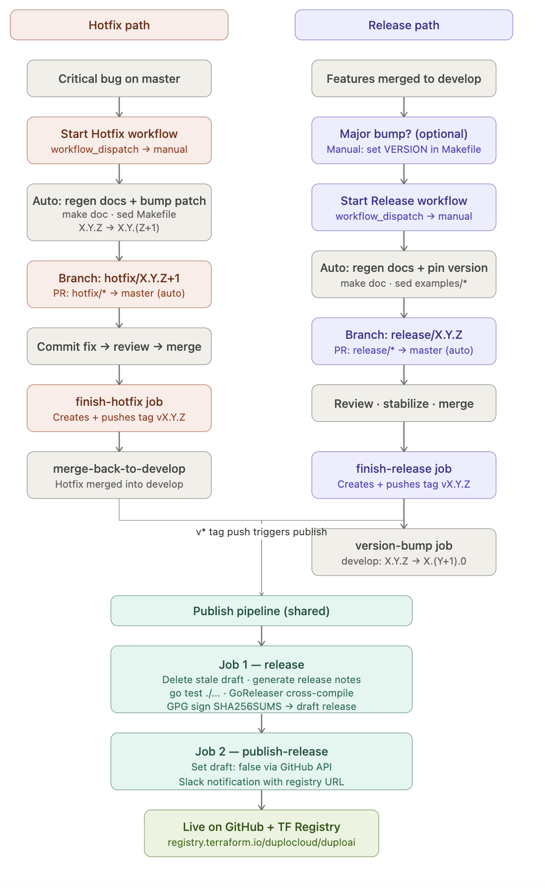

# Release Process

This document is the operational reference for shipping new versions of
`terraform-provider-duploai`. It covers every step of the two release paths —
hotfix and regular release — including what each CI job does, how versioning
increments, and how the shared publish pipeline works.

For PR hygiene, title rules, labels, and branch naming see
[`./git-hygiene.md`](./git-hygiene.md).

---

## 1. Overview

| Scenario | Path | Branch created from |
|---|---|---|
| Critical production fix | **Hotfix** | `master` |
| New features / enhancements | **Release** (minor) | `develop` |
| Breaking changes / major version | **Release** (major, pre-step required) | `develop` |

Both paths converge at the same publish pipeline: merging to `master` creates a
git tag, the tag push triggers GoReleaser, and a draft GitHub Release is
published after a two-job pipeline.



---

## 2. Versioning Scheme

Versions follow `X.Y.Z` (semantic versioning):

| Segment | Meaning | Who increments it |
|---|---|---|
| `X` (major) | Breaking change | **Manual** — set on `develop` before starting a release |
| `Y` (minor) | New feature or enhancement | Auto-incremented on `develop` after every regular release |
| `Z` (patch) | Bug fix or hotfix | Auto-incremented when starting a hotfix |

**Single source of truth:** `Makefile`, line `VERSION=X.Y.Z`.

**Files updated automatically** whenever the version changes (by workflow or
manual step):
- `Makefile` — `VERSION=` line
- `examples/*/main.tf` — lines marked with `# RELEASE VERSION` comment

---

## 3. Hotfix Process

Use this path to ship a critical fix directly to production without waiting for
the next planned release.

### 3.1 When to use

- A bug is in production (`master`) and cannot wait for the next feature release.
- The fix is small and self-contained — it targets `master`, not `develop`.

### 3.2 Start Hotfix

**Trigger:** GitHub Actions → **Start Hotfix** workflow (manual `workflow_dispatch`).

| Input | Required | Effect |
|---|---|---|
| `version` | No | Override the hotfix version. Leave blank to auto-increment the patch number. |

**What the workflow does:**

```
1. Checks out master (full history)
2. Reads VERSION from Makefile → increments patch: X.Y.Z → X.Y.(Z+1)
   (or uses the version override if provided)
3. Runs the ghactions-start-gitflow-release action with is_hotfix: true
   Pre-commit steps run inside the action:
     a. make doc          — regenerates provider documentation
     b. sed Makefile      — sets VERSION=X.Y.(Z+1)
     c. sed examples/**/main.tf — updates version pins (# RELEASE VERSION lines)
4. Creates branch: hotfix/X.Y.(Z+1)
5. Opens PR: hotfix/X.Y.(Z+1) → master (automated)
```

### 3.3 Apply the fix

```
1. Checkout the hotfix/X.Y.Z branch
2. Commit your fix(es) — follow PR hygiene rules (git-hygiene.md §1–4)
3. The auto-created PR already exists; push your commits to it
4. Get the PR reviewed and approved
```

### 3.4 Finish Hotfix (auto-triggered)

**Trigger:** PR merged against `master` where the source branch starts with `hotfix/`.

Two jobs run sequentially:

#### Job 1 — `finish-hotfix`

```
Uses: duplocloud/ghactions-finish-gitflow-release@master
      (is_hotfix: true, validate_merge: false, delete_branch: false)

→ Merges hotfix/X.Y.Z into master (the PR already did the merge; this action
  creates and pushes the git tag vX.Y.Z)
→ Tag push immediately triggers the Release Publish workflow (§5)
```

#### Job 2 — `merge-back-to-develop` (depends on Job 1)

```
1. Checks out develop
2. git fetch origin master
3. git merge origin/master --no-ff  (merge commit message: "Merge hotfix/X.Y.Z back to develop")
4. Pushes develop
```

### 3.5 Edge case: Makefile conflict on merge-back

When `develop` has progressed since the hotfix branch was cut, the `VERSION=`
line in `Makefile` will conflict (develop is ahead on the minor version).

The workflow handles this automatically:

```
- If Makefile is the ONLY conflicted file:
    git checkout --ours Makefile   ← keep develop's (higher) version
    git add Makefile
    git merge --continue
    → merge succeeds; develop's version is preserved

- If ANY other file has conflicts:
    git merge --abort
    → job fails; manual resolution required
```

Manual resolution: resolve the conflicts locally on `develop`, push, and
confirm the resulting `develop` version is correct.

---

## 4. Release Process

Use this path for planned releases containing new features or enhancements.

### 4.1 When to use

- Shipping one or more feature PRs that have been merged to `develop`.
- The version on `develop` (Makefile `VERSION`) is already at the target minor
  version (e.g. `1.3.0` from the previous version-bump).

### 4.2 Major version pre-step

A major version bump (e.g. `1.5.0 → 2.0.0`) has **no dedicated workflow**.
Before triggering Start Release, manually update `develop`:

```bash
# On develop
sed -i 's/^VERSION=.*/VERSION=2.0.0/' Makefile
find examples -name main.tf -exec \
  sed -i 's/\(version = "\)[0-9.]*\(".*# RELEASE VERSION\)/\12.0.0\2/' {} \;
git commit -m "Bump major version to 2.0.0" Makefile examples
git push origin develop
```

Then trigger Start Release as normal (leave the version input blank; it reads
`2.0.0` from Makefile).

After finish-release, the `version-bump` job will set `develop` to `2.1.0`.

### 4.3 Start Release

**Trigger:** GitHub Actions → **Start Release** workflow (manual `workflow_dispatch`).

| Input | Required | Effect |
|---|---|---|
| `version` | No | Override the release version. Leave blank to use the current Makefile VERSION. |

**What the workflow does:**

```
1. Checks out develop (full history)
2. Reads VERSION from Makefile (or uses the version override)
3. Runs the ghactions-start-gitflow-release action with is_hotfix: false
   Pre-commit steps run inside the action:
     a. make doc          — regenerates provider documentation
     b. sed Makefile      — confirms VERSION=X.Y.Z (no-op if already correct)
     c. sed examples/**/main.tf — updates version pins
4. Creates branch: release/X.Y.Z
5. Opens PR: release/X.Y.Z → master (automated)
```

### 4.4 Review the stabilization PR

```
1. Review the auto-created PR: release/X.Y.Z → master
2. Apply any last-minute fixes directly to release/X.Y.Z if needed
   (these PRs will appear in the release changelog)
3. Approve and merge
```

### 4.5 Finish Release (auto-triggered)

**Trigger:** PR merged against `master` where the source branch starts with `release/`.

Two jobs run sequentially:

#### Job 1 — `finish-release`

```
Uses: duplocloud/ghactions-finish-gitflow-release@master
      (validate_merge: false, delete_branch: false)

→ Creates and pushes git tag vX.Y.Z on master
→ Tag push immediately triggers the Release Publish workflow (§5)
```

#### Job 2 — `version-bump` (depends on Job 1)

```
1. Checks out develop
2. Reads current VERSION from Makefile
3. Increments minor, resets patch: X.Y.Z → X.(Y+1).0
4. Updates Makefile + examples/**/main.tf
5. git commit -m "version bump"
6. Pushes develop
```

`develop` is now ready for the next sprint's features at version `X.(Y+1).0`.

---

## 5. Publish Pipeline (shared)

Both hotfix and release flows converge here. Triggered by any `v*` tag push.

**Workflow:** `.github/workflows/release-publish.yml`

### Job 1 — `release`

```
Step 1 — Delete stale draft (if any):
  gh release delete <tag> --yes || true

Step 2 — Generate release notes (Python script):
  a. Finds previous tag via: git tag --sort=-version:refname
  b. Detects the stabilization branch (hotfix/* or release/*) from PRs
     merged to master since the previous tag
  c. Collects work PRs:
     - hotfix/*  → PRs merged into the hotfix branch only
     - release/* → PRs merged into the release branch
                   PLUS PRs merged into develop from prev-tag until
                   the date the release branch was cut from develop
  d. Deduplicates across both sets
  e. Excludes:
       Labels:  ignore-for-release, dependencies
       Authors: github-actions[bot], duploai-tf[bot]
  f. Categorizes by PR label:
       breaking-change → ## Breaking Changes
       enhancement     → ## New Features
       bug             → ## Bug Fixes
       documentation   → ## Documentation
       (anything else) → ## Other Changes
  g. Appends full-changelog link
  h. Writes RELEASE_NOTES.md

Step 3 — Run tests:
  go test ./... -timeout 90s

Step 4 — GoReleaser:
  goreleaser release --clean --release-notes RELEASE_NOTES.md
  Builds cross-platform binaries:
    darwin  amd64 / arm64
    linux   amd64 / arm64 / arm / 386
    windows amd64 / 386
    freebsd amd64 / arm64
  Signs SHA256SUMS with GPG (required by Terraform Registry)
  Creates a DRAFT GitHub Release
```

### Job 2 — `publish-release` (depends on Job 1)

```
Step 1 — Publish draft:
  GitHub API: find draft release matching tag → set draft: false
  (uses GitHub App token, not GITHUB_TOKEN, to bypass branch protections)

Step 2 — Slack notification:
  Posts to SLACK_WEBHOOK with: version, actor, registry URL, release URL
  Registry URL: https://registry.terraform.io/providers/duplocloud/duploai/<version>
```

After this job the release is live on GitHub and visible on the Terraform
Registry (registry propagation can take a few minutes).

---

## 6. Version Bump Reference

| Event | `develop` after | `master` after |
|---|---|---|
| Start Hotfix | unchanged | — |
| Finish Hotfix | `X.Y.Z` (hotfix merged back) | `X.Y.Z` tagged |
| Start Release | unchanged | — |
| Finish Release | `X.(Y+1).0` (version-bump job) | `X.Y.Z` tagged |
| Major pre-step | `X.0.0` (manual commit) | — |
| Finish Release (major) | `X.1.0` (version-bump job) | `X.0.0` tagged |

---

## 7. Required Secrets

All secrets are repository-level (`Settings → Secrets and variables → Actions`).

| Secret | Used by | Purpose |
|---|---|---|
| `GH_APP_ID` | All workflows | GitHub App ID for authenticated operations |
| `GH_APP_PRIVATE_KEY` | All workflows | GitHub App private key |
| `GPG_PRIVATE_KEY` | `release-publish` | Signing key for SHA256SUMS (Terraform Registry requirement) |
| `PASSPHRASE` | `release-publish` | Passphrase for the GPG key |
| `SLACK_WEBHOOK` | `release-publish` | Incoming webhook URL for release notifications |
| `GITHUB_TOKEN` | `release-publish` | Standard GitHub Actions token (auto-provided, no setup needed) |

The GitHub App must have write access to `Contents` (push tags and branches)
and `Pull requests` (open/close PRs) on this repository.
